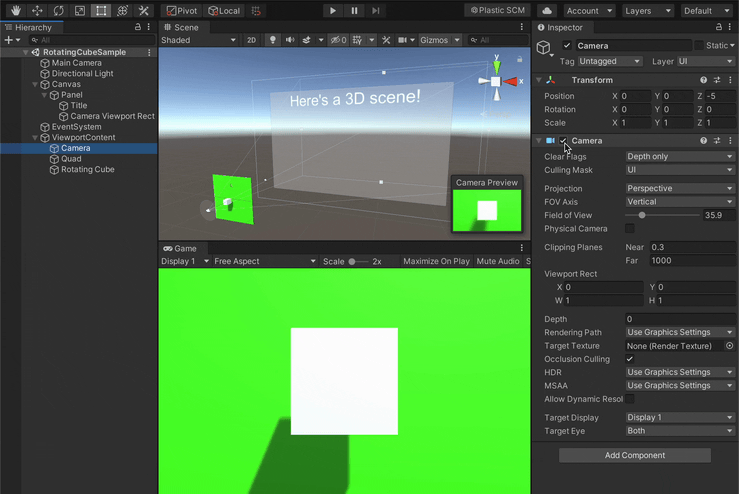

# Camera Viewport Rect
Automatically setup `Camera` viewports from `RectTransform`s.

This way one can easily show 3D models directly into responsive UI without the need of setting up `RenderTexture`s.




## Features
- Supports canvases in both `Screen Space - Camera` and `Screen Space - Overlay` modes.
  Using `Screen Space - Camera` mode is recommended to make sure the camera renders above the UI.
- Supports enabling/disabling the target Camera when the script itself gets enabled/disabled


## How to install
Either:

- Install via [Unity Package Manager](https://docs.unity3d.com/Manual/upm-ui-giturl.html) using the following URL:
  ```
  https://github.com/gilzoide/unity-camera-viewport-rect.git
  ```

- Copy the script [CameraViewportRect.cs](Runtime/CameraViewportRect.cs) directly into your project


## How to use
1. Add a [CameraViewportRect](Runtime/CameraViewportRect.cs) component to any
   object with a `RectTransform`
2. Set the `Camera` property to the camera that should render inside it
3. Enjoy 🍾


## Samples
This UPM package has the following sample scene:
- [RotatingCube](Samples~/RotatingCube/RotatingCubeSample.unity): Simple sample with a rotating cube that appears on a responsive UI